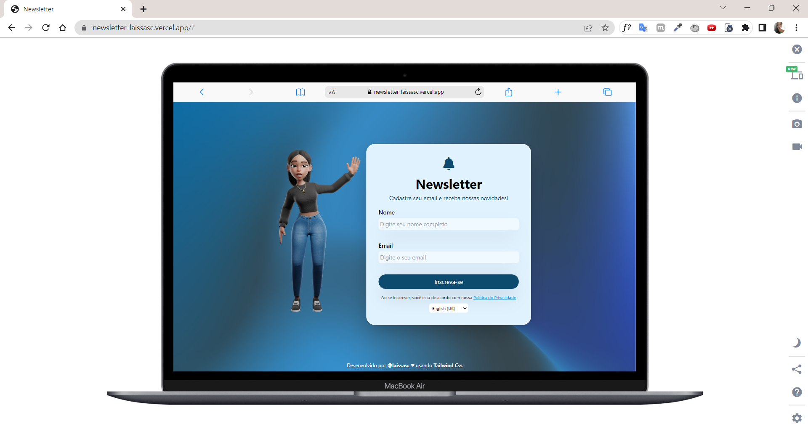

# Newsletter com Tailwind Css👩🏾‍💻<br>

&nbsp;
&nbsp;
&nbsp;
&nbsp;
&nbsp;
<br>

### Este projeto foi desenvolvido com os conceitos aprendidos no curso 'Tailwind CSS: estilizando a sua página com classes utilitárias' da Alura com a instrutora [Beatriz Moura](https://www.linkedin.com/in/beatrizmouradev/).<br><br>

## O que é Tailwind Css? <br>

"Tailwind Css é um Framework que utiliza classes utilitárias diretamente dentro de sua marcação de texto para projetar um elemento.<br>Essas classes possuem um propósito único e basicamente representam as propriedades do CSS." <br><br>

## Como utilizá-lo? <br>

No exemplo a seguir, utilizamos as classes unitárias <kbd>bg-blue-100</kbd> para representar a propriedade <kbd> background-color: rgb(219 234 254)</kbd> e <kbd>text-center</kbd> para representar <kbd> text-align: center</kbd> :
<br><br>

```html
<!DOCTYPE html>
<html lang="pt-br">
  <head>
    <meta charset="UTF-8" />
    <meta http-equiv="X-UA-Compatible" content="IE=edge" />
    <meta name="viewport" content="width=device-width, initial-scale=1.0" />
    <title>Tailwind Css</title>
    <link rel="stylesheet" href="style.css" />
  </head>
  <body>
    <div class="bg-blue-100">
      <h1 class="text-center">Bem-vindo ao Tailwind</h1>
    </div>
  </body>
</html>
```

```css
div {
  background-color: rgb(219 234 254);
}

h1 {
  text-align: center;
}
```

<br>
O resultado esperado deverá ser


<br><br>

### O layout deste projeto foi inspirado em um design disponibilizado no [Figma Community](https://www.figma.com/community).<br><br>

Versões finais Desktop e Mobile:




